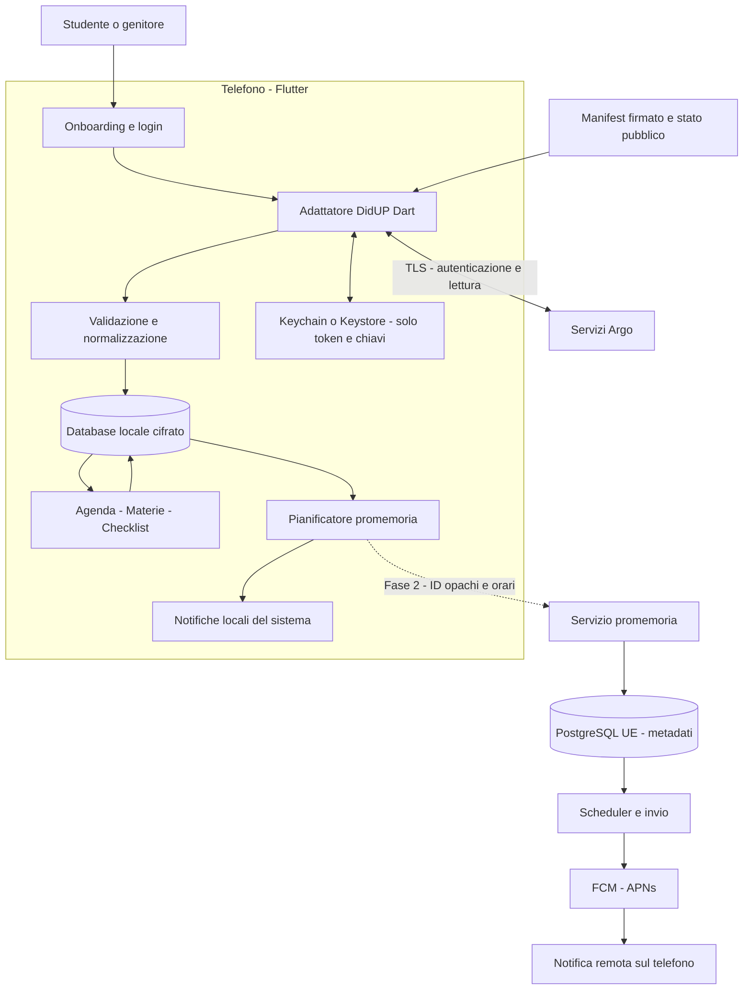
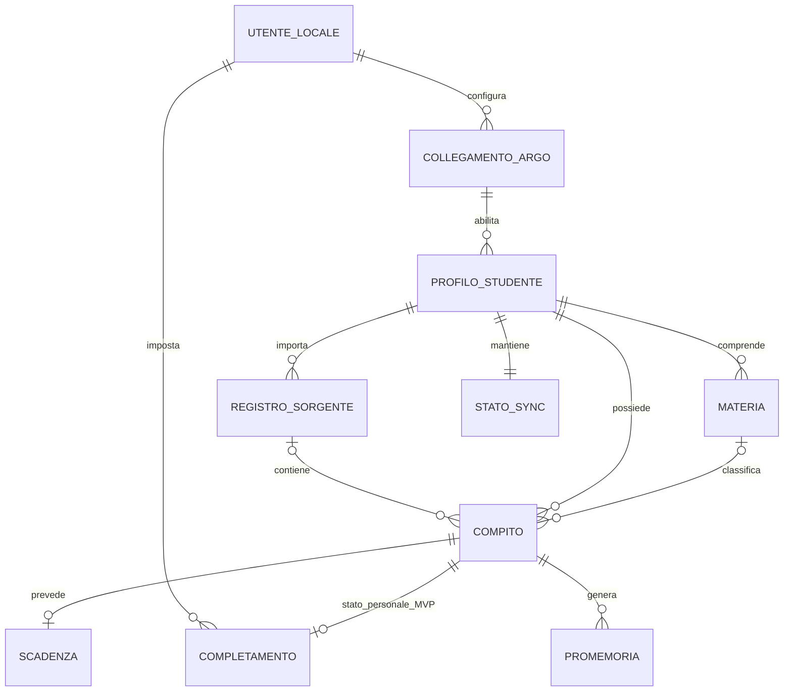

# DiarioUp — Piano tecnico attuativo per fasi

**Versione:** 1.0 — 27 settembre 2026. **Piattaforme:** iOS e Android. **Vincolo confermato:** applicazione in Flutter/Dart. **Stato:** piano di progetto, senza implementazione.

Obiettivo: trasformare i compiti di DidUP Famiglia in un diario personale leggibile, organizzato per materia e scadenza, con countdown, checklist e promemoria. Il progetto è dimensionato per uno sviluppatore esperto o un piccolo team. Le stime assumono lavoro a tempo pieno e accesso a dispositivi fisici.

La proposta parte da un'app che conserva dati e sessione sul telefono. Prima di sviluppare il prodotto completo bisogna verificare accesso consentito, autenticazione senza conservare password e corretta interpretazione dei compiti. I repository citati sono riferimenti tecnici, non una garanzia di funzionamento o un'autorizzazione di Argo. Le verifiche di questo documento riguardano documentazione e sorgenti pubblici: non è stato eseguito un login reale.

Le notifiche locali coprono le scadenze già scaricate. Le vere push sono previste in Fase 2 con un servizio minimo separato. Rilevare nuovi compiti mentre l'app rimane chiusa richiede invece un ulteriore servizio che acceda ad Argo: è una scelta distinta, con costi e responsabilità maggiori. La collocazione delle push dopo il primo MVP è una proposta da confermare, non una riduzione implicita del requisito.

## 1. Stack tecnologico proposto

### 1.1 Scelte per il primo rilascio

| Ambito | Scelta proposta | Motivazione per DiarioUp | Alternative e compromessi |
|---|---|---|---|
| App | Flutter, canale stable, Dart; versione SDK fissata nel progetto | Un solo prodotto iOS/Android, ottimo controllo della grafica e animazioni integrate; rispetta il vincolo richiesto | Due app Swift/Kotlin richiederebbero due implementazioni. Flutter Web non è nel MVP: sicurezza, autenticazione e background andrebbero riprogettati |
| Architettura e stato | Feature separate, viste/view model, repository e servizi; `flutter_riverpod` per dipendenze e stato asincrono | Isola DidUP dalla UI e permette test con dati sintetici senza costruire un framework interno | Bloc è valido se il team lo conosce già, ma aggiunge più struttura. Evitare di mescolare Riverpod, Bloc e altri gestori |
| Navigazione | `go_router` | Gestione dichiarativa di onboarding, sessione scaduta e apertura da notifica | Navigator manuale basta per poche pagine, ma diventa più fragile con collegamenti e ripristino dello stato |
| Rete | `dio`, con timeout, cancellazione e gestione errori centralizzati | Utile per il protocollo DidUP, i cookie temporanei e il controllo delle richieste; logging HTTP disabilitato | `http` ha meno funzionalità ed è sufficiente per protocolli semplici; qui aumenterebbe il codice di coordinamento |
| Integrazione Argo | Piccolo adattatore Dart di sola lettura, versionato e coperto da test di contratto | Si porta solo il protocollo necessario a login, profili e compiti; si evita un backend che custodisce sessioni scolastiche | Wrapper Python in un backend facilita alcune correzioni ma centralizza segreti e operatività. Non incorporare Python nell'app Flutter |
| Database locale | Drift con SQLite cifrato tramite `sqlite3` e SQLite3MultipleCiphers | Query per materia/data, transazioni, migrazioni e separazione fra fonte e checklist | SQLite non cifrato riduce lavoro ma protegge meno i dati estratti dal dispositivo. Store solo key-value complicano relazioni, deduplicazione e migrazioni |
| Segreti | `flutter_secure_storage`: Keychain iOS e protezione basata su Keystore Android | Token e chiave del database fuori dal database stesso; nessuna password persistente | SharedPreferences e file locali non sono depositi di segreti. Biometria per ogni lettura impedirebbe il recupero in background |
| Notifiche locali | `flutter_local_notifications`, `timezone` e rilevamento del fuso del dispositivo | Promemoria offline per dati già noti, senza un server per ogni utente | Sole push rendono il promemoria dipendente dalla rete; non risolvono comunque l'aggiornamento dei compiti da Argo |
| Background | `workmanager`, come opportunità di aggiornamento | Collega Flutter ai meccanismi supportati dal sistema operativo | Timer Dart permanenti, servizi sempre accesi e polling ogni minuto non sono sostenibili su mobile |
| UI e motion | Material 3 personalizzato, API animate Flutter; `animations` e uso limitato di `flutter_animate` | Base accessibile e piccola libreria di componenti DiarioUp; dettagli nella sezione 12 | Rive/Lottie solo per eventuali asset dedicati successivi; un grande kit UI esterno non garantisce una migliore identità |
| Qualità | `flutter_test`, test di integrazione su dispositivi, golden test dei componenti, analisi statica | Protegge soprattutto date, sincronizzazione, privacy e migrazioni | Non serve una piattaforma E2E separata nel MVP se i test Flutter coprono i percorsi critici |

La separazione proposta segue la [guida architetturale Flutter](https://docs.flutter.dev/app-architecture/guide), adattandola a poche funzionalità. Riferimenti dei componenti: [Riverpod](https://riverpod.dev/docs/introduction/getting_started), [go_router](https://pub.dev/packages/go_router), [Dio](https://pub.dev/packages/dio).

**Attenzione alla cifratura:** la documentazione corrente di Drift propone `NativeDatabase` con SQLite3MultipleCiphers tramite build hooks; dalle versioni indicate nella guida, Drift 2.32 e sqlite3 3.x, la vecchia integrazione con `sqlcipher_flutter_libs` non è più la scelta diretta raccomandata. Fissare una combinazione compatibile e verificare in build release che il motore cifrante sia realmente attivo. La presenza del pacchetto non basta. [Drift — Encryption](https://drift.simonbinder.eu/platforms/encryption/).

Prima di fissare le dipendenze: controllare manutenzione, licenze, dipendenze transitive, supporto delle architetture dei dispositivi e requisiti minimi del sistema operativo. Salvare il lockfile dell'app; aggiornamenti tramite revisione e test. Proposta iniziale di supporto: iOS 16+ e Android 9+, da validare rispetto ai telefoni del gruppo pilota e ai plugin scelti. Il target SDK Android e Xcode seguiranno i requisiti degli store al momento del rilascio.

### 1.2 Backend, database remoto e infrastruttura

**Fase 1:** nessun backend applicativo che riceva credenziali, token o compiti. Un sito statico, ad esempio Cloudflare Pages, ospita informativa, assistenza, stato del servizio e manifest di compatibilità firmato. La distribuzione globale implica comunque valutare log tecnici e fornitori; non equivale a hosting esclusivamente UE. GitHub Actions esegue test e monitoraggio dei file upstream. Build iOS su Mac del team o runner macOS; un PC Windows da solo non basta per compilare e verificare iOS. [Cloudflare Pages](https://developers.cloudflare.com/pages/).

**Fase 2, solo se confermate le push:** Supabase gestito in una regione specifica UE, ad esempio Francoforte, con PostgreSQL, autenticazione anonima per installazione, Row Level Security, Cron e poche Edge Functions TypeScript. Flutter resta il frontend. Il piccolo componente TypeScript costa meno manutenzione di un server, database, backup e scheduler amministrati separatamente. Conserva esclusivamente dati di consegna dei promemoria, non le credenziali o il contenuto scolastico.

Supabase consente di scegliere una regione specifica; la sola selezione generica “Europe” non costituisce una garanzia di residenza UE. Regione del database, esecuzione delle funzioni, log, backup e subfornitori vanno verificati separatamente. [Regioni Supabase](https://supabase.com/docs/guides/platform/regions). Cron può richiamare funzioni e registrarne gli esiti. [Supabase Cron](https://supabase.com/docs/guides/cron).

Alternative per la Fase 2: Firebase per tutto il backend riduce il numero di fornitori, ma introduce Firestore e un modello diverso dal database relazionale; un servizio Dart con Serverpod mantiene un linguaggio unico, ma aumenta le responsabilità operative iniziali. Un backend Python/FastAPI è giustificato solo se si sceglie esplicitamente la sincronizzazione Argo sul server, non per inviare semplici promemoria.

**Push:** `firebase_messaging` nell'app; FCM per Android e instradamento verso APNs per iOS. Non serve Firebase Analytics. Le credenziali del servizio di invio e la chiave APNs sono segreti del backend, mai inclusi nell'app. [FlutterFire — configurazione FCM](https://firebase.google.com/docs/cloud-messaging/flutter/get-started).

### 1.3 Budget operativo indicativo

Questi sono stanziamenti di progetto, non preventivi o tariffe garantite: escludono IVA, lavoro, consulenza legale e acquisto di dispositivi.

| Scenario | Budget mensile iniziale da riservare | Principale voce di costo |
|---|---|---|
| MVP locale, beta 30–100 persone | 0–40 euro, oltre a dominio e account store | Build macOS, hosting statico, eventuale monitoraggio |
| Push minime, circa 1.000 installazioni attive | 30–100 euro | Piano backend gestito, funzioni, log e build |
| Sincronizzazione Argo su server | 100–300 euro come prima riserva, da misurare | Worker, custodia token, monitoraggio, assistenza; il lavoro umano può superare il costo cloud |

Esempio di dimensionamento: due invii giornalieri per 1.000 installazioni sono circa 60.000 tentativi push/mese. Non sono 60.000 richieste ad Argo. Con polling server ogni due ore per 12 ore, 1.000 utenti produrrebbero invece almeno 6.000 cicli Argo/giorno, ciascuno potenzialmente composto da più richieste: è una diversa scala di rischio.

Verificare prezzi e quote prima dell'acquisto; non fondare la produzione sulla permanenza di un piano gratuito. Riservare inoltre 0,5–1 giornata/settimana a manutenzione, supporto e controlli, con picchi durante i cambi Argo. Account store e test fisici sono voci separate. [Account Apple Developer](https://developer.apple.com/help/account/basics/about-your-developer-account), [Google Play Console](https://support.google.com/googleplay/android-developer/answer/6112435?hl=en).

## 2. Architettura del sistema

### 2.1 Flusso raccomandato

**Sul client:** autenticazione, scelta del profilo, richieste Argo, parser, riconciliazione, cifratura, checklist, countdown, vista offline e pianificazione locale. Il database è la fonte per la UI; la rete aggiorna il database e non alimenta direttamente le schermate. Un errore di sincronizzazione non deve svuotare l'agenda.

**Nei servizi DiarioUp:** in Fase 1 soltanto configurazione pubblica e stato; in Fase 2 autenticazione tecnica dell'installazione e invio dei promemoria. Argo non invia webhook a DiarioUp. Una push FCM non costituisce una nuova fonte dei compiti.

Organizzazione futura del progetto: moduli `onboarding`, `auth`, `agenda`, `subjects`, `settings`; componenti condivisi `didup_adapter`, `sync`, `storage`, `notifications`, `design_system`. Si tratta di confini progettuali, non di microservizi. L'adattatore espone operazioni concettuali di login, elenco profili, lettura compiti, eventuale rinnovo e disconnessione. La UI non conosce nomi dei campi Argo o URL degli endpoint.

### 2.2 Tre capacità da tenere separate

| Capacità | Architettura necessaria | Limite da comunicare |
|---|---|---|
| Ricordare compiti già scaricati, anche offline | Solo app e notifiche locali | Le successive modifiche Argo non sono note finché non avviene una nuova sync |
| Ricevere vere push per scadenze già note | App e backend di soli promemoria | Serve rete per la consegna; il server non conosce nuovi compiti |
| Scoprire nuovi compiti senza riaprire l'app per giorni | Accesso periodico Argo dal server oppure futura integrazione ufficiale | Richiede token Argo utilizzabili sul server, rinnovo verificato, base giuridica e costi aggiuntivi; consegna comunque non istantanea o garantita |

La terza capacità non viene simulata mediante silent push. Se diventa obbligatoria, prima della sua implementazione occorre aggiornare architettura, valutazione privacy, budget e condizioni d'accesso. Nessun passaggio automatico dal funzionamento locale alla custodia remota dei token.

## 3. Strategia di autenticazione e gestione credenziali

### 3.1 Che cosa emerge dai riferimenti tecnici

`didupwrapper` dichiara OAuth2/PKCE e offre client Python e modelli Pydantic; il pacchetto è classificato Alpha e la release PyPI osservata è 0.1.1. La descrizione non prova continuità di manutenzione. [PyPI didupwrapper](https://pypi.org/project/didupwrapper/).

Nei sorgenti esaminati il flusso OAuth precede una sessione applicativa Argo: non basta conservare un generico access token. Il wrapper conserva il refresh token ma, nello snapshot verificato, non implementa il relativo rinnovo e riutilizza credenziali in memoria per rieffettuare il login. I parametri fanno riferimento al client dell'app ufficiale. Questa non è la prova dell'esistenza di un OAuth pubblico registrabile da DiarioUp. [Sorgente auth.py verificato](https://github.com/Rocciadura/didupAPI-wrapper/blob/e98a9a67f4d1770ecda271e7a981efadd4d26e20/didupwrapper/auth.py).

`portaleargo-api`, usato da argo-dashboard, implementa invece un rinnovo applicativo tramite `auth/refresh-token`. È un candidato da studiare, non un comportamento già validato per DiarioUp. Il progetto dashboard non va descritto come dimostrazione che tutto giri esclusivamente sul client: occorre seguire le sue chiamate server. [BaseClient verificato](https://github.com/DTrombett/portaleargo-api/blob/df846555471f95836450c8af84e4efde11e3cb08/src/BaseClient.ts), [argo-dashboard](https://github.com/DTrombett/argo-dashboard).

### 3.2 Flusso di login previsto

1. Presentare natura indipendente dell'app, trattamento dei dati e percorso età/genitore prima di richiedere dati scolastici.
2. Preferire il browser di sistema con PKCE se Argo consente un client e un redirect adatti a DiarioUp. In questo caso la password resta nella pagina Argo e non passa dal codice dell'app.
3. Se tale modalità non è disponibile, valutare nel gate iniziale il protocollo diretto del wrapper: codice scuola, username e password vengono usati sul telefono soltanto per l'autenticazione TLS, senza transito nei servizi DiarioUp. Questa modalità richiede verifica tecnica e delle condizioni applicabili; non si assume automaticamente consentita.
4. Generare `state` e PKCE verifier casuali per ogni tentativo; verificare callback, destinazione, corrispondenza dello stato e timeout. Seguire soltanto host e redirect verificati. Non copiare ciecamente client ID, redirect o versioni ufficiali per aggirare controlli.
5. Distinguere token OAuth, token applicativo Argo, refresh token e cookie effettivamente necessari. Conservare solo quelli che il protocollo validato richiede, con metadati di scadenza.
6. Presentare la scelta del profilo se l'account restituisce più studenti. Nessuna selezione silenziosa del primo figlio. In MVP si gestisce un solo profilo attivo, con isolamento dei suoi dati.
7. Rilasciare immediatamente password, form e cookie temporanei non necessari. Non mantenere un oggetto “credenziali” per il prossimo rinnovo.

**Vincolo password:** nessuna persistenza, nemmeno cifrata, nel progetto raccomandato. Nessuna password in SharedPreferences, database, file, variabili d'ambiente di servizi, crash report, cache o secret CI per account scolastici reali. Il breve trattamento in RAM durante un login diretto è necessario al protocollo e non equivale a un salvataggio; in Dart non si promette l'azzeramento fisico garantito di tutte le copie create dal runtime. Ridurre durata e copie, disabilitare ripristino del campo password e dump diagnostici.

### 3.3 Durata, rinnovo e invalidazione

| Evento | Comportamento richiesto |
|---|---|
| Token valido | Usarlo dal secure storage; mai inserirlo in URL, log o database dei compiti |
| Scadenza esplicita | Rispettare il valore restituito da Argo; anticipare il rinnovo di 60–120 secondi se il protocollo lo supporta |
| Scadenza non documentata | Non inventare durata di un'ora o 30 giorni: gestire l'esito server e misurare nel prototipo autorizzato |
| Rinnovo disponibile e verificato | Un solo rinnovo concorrente per account; sostituzione atomica dei token ruotati; poi una sola ripetizione della richiesta originale |
| Rinnovo assente o respinto | Sospendere richieste automatiche, mostrare “Accedi di nuovo”; conservare la vista offline |
| Credenziali errate | Nessun retry automatico del login con password; evitare blocchi dell'account |
| 401 / 403 | Distinguere sessione scaduta, permessi e blocco dell'integrazione; non ripetere all'infinito refresh/login |
| Sessione invalidata da Argo | Eliminare token invalidi e chiedere un nuovo login al successivo uso; non recuperare password dal dispositivo |
| 30 giorni senza uso dell'app | Proposta di limite locale di inattività: eliminare la sessione al successivo avvio prima di usare la rete; non è la durata dichiarata da Argo |
| Uscita esplicita | Tentare revoca se esiste un endpoint verificato; cancellare token, dati e promemoria locali del profilo. In Fase 2 disattivare anche registrazione e pianificazioni remote secondo la procedura di cancellazione |

Su iOS, impostazione prudente iniziale: segreti accessibili a dispositivo sbloccato, non sincronizzati con iCloud. I tentativi background con telefono bloccato possono quindi essere saltati. L'accessibilità dopo il primo sblocco, limitata al dispositivo, è un'opzione successiva da valutare esplicitamente per migliorare il background. Non introdurre un prompt biometrico dentro un job automatico. Su Android verificare chiavi, esclusione dai backup e comportamento dopo reinstallazione. [flutter_secure_storage](https://pub.dev/packages/flutter_secure_storage).

## 4. Modello dati

### 4.1 Entità locali

Gli ID interni sono UUID casuali. Gli identificatori sorgente rimangono nel database cifrato. Nessuna tabella contiene password; la tabella di collegamento non contiene i token, ma solo il riferimento al loro spazio nel secure storage.

| Entità | Campi essenziali | Relazioni e regole |
|---|---|---|
| UtenteLocale | `id`, lingua, tema, fuso, preferenze, versione informativa, fascia età se necessaria | Un utilizzatore dell'installazione; nessuna registrazione con email nel MVP |
| CollegamentoArgo | `id`, `utente_id`, codice scuola, ruolo dichiarato/osservato, riferimento segreti, stato sessione | Un collegamento può rendere accessibili più profili; username persistente solo se necessario e cifrato |
| ProfiloStudente | `id`, `collegamento_id`, `source_profile_id`, anno scolastico, alias locale | Ambito obbligatorio di tutte le query; nominativi completi non necessari alla schermata principale |
| Materia | `id`, `profilo_id`, `anno_scolastico`, `source_subject_id`, nome, colore scelto | Il nome non è la chiave: due materie omonime possono essere distinte |
| RegistroSorgente | `id`, `profilo_id`, `source_pk`, revisione, stato sorgente, giorno del registro | Mappa persistente del record padre ai compiti; conserva solo metadati necessari, non il JSON originale. Consente cancellazioni e aggiornamenti per `pk` |
| Compito | `id`, `profilo_id`, `materia_id` opzionale, `registro_sorgente_id` opzionale, identità elemento annidato, origine, testo, `assigned_on` opzionale, revisione/hash contenuto, `first_seen_at`, `updated_at`, stato sorgente | Origine `argo` o `manuale`; il docente resta proprietario del testo Argo. Materia sconosciuta ammessa con etichetta esplicita |
| Scadenza | `id`, `compito_id` univoco, `due_date_source` opzionale, `due_date_personal` opzionale, eventuale ora sorgente, fuso scolastico, precisione e provenienza | Zero o una configurazione per compito. Il valore personale non sovrascrive quello Argo; nel MVP è ammesso per compiti manuali o senza data sorgente. Data senza ora non diventa una falsa mezzanotte UTC |
| Completamento | `utente_id`, `compito_id`, `is_done`, `done_at`, revisione completata | Chiave composta unica; stato personale che non viene inviato ad Argo |
| Promemoria | `id`, `compito_id` o riferimento al riepilogo, orario previsto, modalità, ID sistema, revisione, stato | Cancellazione/ricalcolo dopo modifica, completamento, cambio fuso o eliminazione |
| StatoSync | `profilo_id`, versione adattatore, cursore opaco, ultimo tentativo, ultimo successo, copertura temporale, categoria errore | Il cursore avanza solo dopo la transazione riuscita; non sostituisce la data di ultimo successo |

### 4.2 Normalizzazione e identità dei compiti

Nel modello verificato di `portaleargo-api`, il registro ha una chiave `pk`, una materia, un giorno di lezione e compiti annidati con testo e `dataConsegna`; gli elementi annidati non espongono necessariamente un proprio ID. La data del registro è una candidata data di assegnazione, da confermare sui casi reali, non la prova dell'istante di pubblicazione. Non sostituirla con `first_seen_at`. [Tipi del protocollo osservato](https://github.com/DTrombett/portaleargo-api/blob/df846555471f95836450c8af84e4efde11e3cb08/src/types/apiTypes.ts).

Regole di implementazione:

- Usare l'ID sorgente del compito quando disponibile; altrimenti il record padre e una mappa persistente degli elementi annidati. Confrontare prima gli elementi invariati; riconciliare le modifiche solo quando la corrispondenza è univoca.
- Un hash di testo e scadenza identifica una revisione, non è da solo un'identità stabile. Quando il professore corregge il testo non deve comparire automaticamente un nuovo compito perdendo la checklist.
- Se due elementi sono indistinguibili o la corrispondenza resta ambigua, non trasferire una spunta a un altro compito: conservare la vecchia voce come non confermata e chiedere verifica locale. Documentare questo limite nell'adattatore.
- Conservare separati valore sorgente e preferenze personali. Una scadenza personale aggiunta a un compito senza data deve essere indicata come “impostata da te”.
- In caso di modifica significativa di un compito già completato, mantenere data e revisione dell'ultimo completamento e indicare “Modificato dopo il completamento — da ricontrollare”. Non fingere che la nuova versione sia già stata svolta. Il MVP non conserva una cronologia di tutte le spunte.
- `assigned_on` e le date di scadenza possono essere null. Testo incompleto o data ambigua non devono produrre una scadenza inventata. Vista “Senza scadenza” e indicazione di dati incompleti.
- Per le date scolastiche usare il calendario `Europe/Rome`; istanti tecnici in UTC. Countdown giornaliero “oggi/domani/tra N giorni”, senza secondi. L'orario personale di promemoria è distinto dalla scadenza del professore.
- Salvare testo normalizzato, conservando paragrafi e significato; niente esecuzione HTML o caricamento automatico di contenuti remoti. Collegamenti esterni solo su azione dell'utente.

Indici iniziali: profilo+anno, profilo+materia, compito+stato e scadenza. Ogni migrazione deve preservare gli ID interni e i completamenti; se fallisce, mantenere la copia cifrata precedente e impedire scritture incompatibili.

### 4.3 Estensione remota per le push

Solo in Fase 2: `Installazione` con identità tecnica, token FCM e ultimo contatto; `PianificazioneRemota` con ID casuale, data invio UTC, versione, stato e scadenza di conservazione; eventuale outbox per i tentativi d'invio. Il server non riceve ID Argo, materia, testo, nome studente o voti. Gli ID casuali e il token push sono comunque dati personali pseudonimi, non dati anonimi.

## 5. Strategia di sincronizzazione

### 5.1 Frequenza e condizioni

| Trigger | Regola proposta |
|---|---|
| Primo login | Importazione iniziale del profilo selezionato; mostrare dati solo dopo validazione |
| Avvio o ritorno in primo piano | Sincronizzare se l'ultimo successo risale a oltre 15 minuti; visualizzare subito la cache |
| Aggiornamento manuale | Consentito con intervallo minimo di 30 secondi e una richiesta in corso per account |
| App aperta a lungo | Rivalutare l'aggiornamento ogni 30 minuti mentre è visibile, senza timer permanente in background |
| Background | Richiedere un'opportunità ogni 4–6 ore, con rete disponibile; su iOS è il sistema a decidere se e quando eseguire |
| Sessione scaduta, profilo disabilitato o integrazione sospesa | Nessun polling finché non viene risolta la condizione |

Questi intervalli sono scelte conservative del progetto, non quote ufficiali Argo. Adattarli ai risultati del pilota senza aumentare carico per compensare un blocco. Android WorkManager non garantisce l'orario e iOS BGTaskScheduler può non concedere esecuzione per molto tempo. Il task Flutter gira in un isolate separato: database, plugin e disponibilità delle chiavi vanno verificati in quel contesto. [Workmanager — guida](https://docs.page/fluttercommunity/flutter_workmanager/quickstart).

Su iOS la chiusura forzata e su Android il force-stop dalle impostazioni hanno conseguenze diverse dal semplice passaggio in background. Non promettere un nuovo controllo quando l'utente ha forzato l'arresto. Neppure i messaggi background di FCM aggirano queste condizioni. [FlutterFire — ricezione messaggi](https://firebase.google.com/docs/cloud-messaging/flutter/receive-messages).

### 5.2 Protocollo di riconciliazione

1. Acquisire un lock per il collegamento e il profilo. Riutilizzare la sessione valida; risolvere al massimo un rinnovo concorrente.
2. Richiedere solo gli endpoint necessari. Se il protocollo permette soltanto una dashboard aggregata, filtrare subito in RAM e non persistere le altre categorie.
3. Stabilire se la risposta è snapshot completo, pagina di uno snapshot oppure delta. Registrare ambito, cursore e copertura; non assumere che rappresenti tutto l'anno scolastico.
4. Validare struttura, tipi e date. Campi extra possono essere ignorati in modo controllato; mancanza di identità o indicatori di reset invalida la riconciliazione. Voci parzialmente leggibili restano esplicitamente incomplete e non giustificano cancellazioni.
5. Applicare inserimenti, modifiche e cancellazioni in un'unica transazione. Conservare checklist e preferenze in tabelle indipendenti. Aggiornare il cursore soltanto al commit.
6. Ricalcolare le notifiche a partire dal database consolidato, in modo ripetibile. Un arresto fra commit e pianificazione viene corretto al successivo avvio.
7. Aggiornare “Ultimo aggiornamento riuscito”, separandolo da “Ultimo tentativo”. Mostrare “Dati non aggiornati da ieri” quando opportuno.

Nel protocollo osservato esistono `dataultimoaggiornamento`, operazioni sui record e richieste di reset. **Assenza di un compito dal delta non significa cancellazione.** `operazione=D` riguarda la chiave del record; `I` o l'assenza prevista dal protocollo vanno interpretate secondo il contratto verificato. Gestire `rimuoviDatiLocali`, `ricaricaDati` e `profiloDisabilitato` con percorsi dedicati, senza azzerare alla cieca le annotazioni personali. Dopo un reset della cache sorgente, ricostruire e riconciliare prima di confermare lo stato finale. [Gestione operazioni di riferimento](https://github.com/DTrombett/portaleargo-api/blob/df846555471f95836450c8af84e4efde11e3cb08/src/util/handleOperation.ts).

Se una futura versione fornisce soltanto snapshot: riconciliare esclusivamente l'intervallo dichiarato completo, dopo aver acquisito tutte le pagine. L'assenza in una pagina, in un intervallo diverso o in una risposta sospetta non elimina dati. Dove non c'è un segnale esplicito, marcare “non più confermato” e verificare con una seconda lettura completa anziché distruggere la voce.

Importazione iniziale: preferire anno scolastico corrente se supportato. Se Argo impone una finestra diversa, mostrarla e dichiarare la copertura; una vista vuota non prova che non esistano compiti. Le finestre di lettura e gli eventuali parametri incrementali sono risultati obbligatori del prototipo, non endpoint inventati nel piano.

### 5.3 Errori, limiti e conflitti

- Timeout indicativi: 10 secondi connessione, 20 secondi risposta, lavoro background entro il tempo concesso dal sistema. Nessun tentativo di tenere viva artificialmente l'app.
- Rete e 5xx: massimo due retry, con attese crescenti e componente casuale; poi si rinvia al prossimo trigger. Il recupero dei dati offline rimane disponibile.
- 429: rispettare `Retry-After`; se assente applicare un raffreddamento iniziale di 15 minuti, crescente fino a ore. È una politica DiarioUp, non una quota Argo.
- 401: tentativo singolo di rinnovo se supportato. 403, 410 o formato inatteso richiedono classificazione: un errore di compatibilità non deve chiedere ripetutamente la password.
- Cambio anno, scuola o profilo: separare namespace e cursori, annullare lavori del precedente profilo e presentare il contesto attivo. Mai fondere materie e compiti di due studenti.
- Modifiche locali “fatto/non fatto” vincono sul nuovo import Argo perché riguardano un altro attributo. Una variazione della consegna del docente genera invece una revisione da ricontrollare.

## 6. Sistema di notifiche

### 6.1 Politica di prodotto

Default proposto: un riepilogo alle 18:00 del giorno precedente per i compiti non completati; secondo promemoria la mattina soltanto su scelta dell'utente. Orari modificabili, quiete notturna 21:00–07:00 e possibilità di disattivare tutto. Nessun avviso per scadenze non definite; i compiti manuali possono avere una scadenza impostata dall'utente.

Richiedere il permesso dopo che l'utente ha visto l'utilità dei promemoria, non alla prima schermata. Se nega il permesso, agenda e checklist continuano a funzionare. La UI mostra lo stato del permesso e consente di aprire le impostazioni del sistema senza richieste ripetute.

Testo standard nella schermata bloccata e nel payload di sistema: **“Hai attività da controllare in DiarioUp”**. Il dettaglio scolastico compare dentro l'app. Il MVP non mette materia, testo del compito, nomi o informazioni familiari nelle notifiche, neppure locali.

### 6.2 Differenze fra iOS e Android

| Piattaforma | Implementazione e limiti |
|---|---|
| iOS | Programmazione locale tramite UserNotifications; il plugin documenta un limite di 64 notifiche pendenti. Pianificare una finestra di 14 giorni con un massimo progettuale di 32 richieste, raggruppando per giornata. Focus, riepiloghi e impostazioni utente possono influenzare la presentazione |
| Android | Canale “Promemoria compiti”, permesso runtime quando richiesto dalla piattaforma; utilizzare allarmi non esatti. Configurare il ripristino dopo reboot. Doze, risparmio energetico e personalizzazioni dei produttori possono ritardare gli avvisi |
| Entrambe | Rigenerare il piano dopo sync, completamento, modifica, cambio fuso/ora, variazione preferenze e avvio dell'app. Annullare gli ID precedenti. Aprire la vista corretta dalla notifica senza esporre dati nel link |

Riferimenti: [flutter_local_notifications e limiti](https://pub.dev/packages/flutter_local_notifications), [Apple — notifiche locali](https://developer.apple.com/library/archive/documentation/NetworkingInternet/Conceptual/RemoteNotificationsPG/SchedulingandHandlingLocalNotifications.html), [Android — allarmi](https://developer.android.com/develop/background-work/services/alarms), [Android — permessi notifiche](https://developer.android.com/develop/ui/views/notifications/notification-permission).

La precisione al secondo non è necessaria per un diario. Non richiedere permessi per exact alarm nel MVP. La pianificazione locale già registrata può essere eseguita dal sistema senza riaprire Flutter, ma non può conoscere cambi successivi ad Argo. Se l'app non viene aperta per oltre la finestra pianificata, non promettere avvisi futuri illimitati.

### 6.3 Vere push in Fase 2

Il client, dopo l'attivazione esplicita, registra il token FCM e invia solo la pianificazione generica: ID casuale, istante UTC, versione, scadenza del messaggio. Il backend autenticato accetta esclusivamente record della propria installazione, con limiti di volume e orizzonte massimo di 30 giorni. Lo scheduler ogni minuto prende i job dovuti, li marca tramite lock/lease, invia a FCM e registra l'esito tecnico.

Usare una chiave idempotente per evento e versione; retry limitati con backoff e scadenza, eliminazione dei token non validi, gestione della rotazione del token FCM. L'accettazione da parte del provider non è prova che l'utente abbia visto l'avviso. Non promettere consegna esattamente una volta: un crash dopo invio ma prima della conferma può causare duplicati.

L'autenticazione anonima Supabase identifica l'installazione, non autentica lo studente presso Argo. Applicare RLS per proprietario e mantenere privilegi amministrativi soltanto nelle funzioni server. Configurare rate limit e protezione dagli abusi compatibili con il pubblico minorenne. La cancellazione automatica degli utenti anonimi va implementata: non è implicita nel servizio. [Supabase — accessi anonimi](https://supabase.com/docs/guides/auth/auth-anonymous), [RLS](https://supabase.com/docs/guides/database/postgres/row-level-security).

**Evitare il doppio avviso:** una sola modalità per installazione e categoria, locale oppure remota. Il cambio richiede riconciliazione e conferma delle cancellazioni; non attivare un fallback locale automatico quando manca la conferma del server. Una spunta eseguita offline non può annullare immediatamente una push già pianificata nel cloud: rendere visibile la modifica in attesa di invio. Non considerare questa modalità più aggiornata di quella locale.

Disabilitare l'auto-inizializzazione FCM prima dell'adesione alla funzione, e verificare gli altri invii automatici dell'SDK. Le push remote non sono un motivo per aggiungere Analytics. La residenza UE del database non implica che APNs/FCM elaborino tutto esclusivamente nell'UE.

## 7. Piano di resilienza sull'integrazione non ufficiale

### 7.1 Riferimenti verificati e limiti

| Progetto | Uso nel piano | Esito della verifica pubblica |
|---|---|---|
| [didupwrapper](https://pypi.org/project/didupwrapper/) / [didupAPI-wrapper](https://github.com/Rocciadura/didupAPI-wrapper) | OAuth e struttura delle richieste | MIT, pacchetto Alpha; non prendere i modelli come specifica completa del delta |
| [portaleargo-api](https://github.com/DTrombett/portaleargo-api) | Refresh applicativo, tipi e riconciliazione | MIT; riferimento principale aggiuntivo emerso da argo-dashboard |
| [argo-dashboard](https://github.com/DTrombett/argo-dashboard) | UX e separazione login/client | MIT; il primo login passa dal server. La persistenza web in localStorage non va trasferita in Flutter |
| [argofamiglia](https://github.com/salvatore-abello/argofamiglia) | Esempio di raggruppamento per scadenza | Repository archiviato; `getCompitiByDate()` resta un esempio, non una dipendenza attuale |
| [argo-family-dashboard](https://github.com/fcaloro-beep/argo-family-dashboard) | Confronto protocollo, profili e segnali di cambiamento | MIT; la gestione delle credenziali in Home Assistant non rispetta automaticamente i vincoli DiarioUp |
| [App Flutter peppelg](https://github.com/peppelg/argo_scuolanext_famiglia_unofficial_app) | Precedente Flutter e idee di struttura | Unlicense per il codice, asset da verificare separatamente; vecchio protocollo, non base da collegare direttamente |
| [ArgoScuolaNext hearot](https://github.com/hearot/ArgoScuolaNext) | Riferimento storico indicato nel brief | Non reperibile nella verifica: non si confermano attuale accessibilità, licenza o percorsi dei file |

I modelli di `didupwrapper` osservati possono perdere campi di identità e operazione, e il metodo che estrae i soli compiti può perdere il contesto del registro. Un port meccanico sarebbe rischioso. [models.py verificato](https://github.com/Rocciadura/didupAPI-wrapper/blob/e98a9a67f4d1770ecda271e7a981efadd4d26e20/didupwrapper/models.py).

### 7.2 Watchlist dei file API

Questi percorsi sono stati verificati sui repository pubblici. In implementazione registrarli in un manifest di monitoraggio revisionato, insieme a branch, commit iniziale, blob SHA e motivo del controllo. Non usare il numero di commit generici come allarme API.

| Priorità | Repository e riferimento osservato | Percorsi da sorvegliare |
|---|---|---|
| P1 | `Rocciadura/didupAPI-wrapper`, `main`, `e98a9a67f4d1770ecda271e7a981efadd4d26e20` | `didupwrapper/auth.py`; `didupwrapper/client.py`; `didupwrapper/models.py`; `didupwrapper/exceptions.py`; `didupwrapper/endpoints/registro.py` |
| P1 | `DTrombett/portaleargo-api`, `main`, `df846555471f95836450c8af84e4efde11e3cb08` | `src/BaseClient.ts`; `src/util/Constants.ts`; `src/util/getCode.ts`; `src/util/getToken.ts`; `src/util/generateLoginLink.ts`; `src/util/encryptCodeVerifier.ts`; `src/util/handleOperation.ts`; `src/types/apiTypes.ts`; `src/schemas/index.ts`; `src/schemas/utilityTypes.ts` |
| P2 | `fcaloro-beep/argo-family-dashboard`, `main`, `b88b9f772fdf96431518119e729c1049ffc46c19` | `custom_components/argo_family_dashboard/argo_client.py`; `custom_components/argo_family_dashboard/const.py`; `custom_components/argo_family_dashboard/config_flow.py`; `custom_components/argo_family_dashboard/coordinator.py` |
| P3 | `DTrombett/argo-dashboard`, `main` | `app/actions.ts`; `components/auth/LoginForm.tsx`; `components/dashboard/ClientProvider.tsx`; nei manifest delle dipendenze soltanto le variazioni relative a `portaleargo-api` |
| Storico, controllo manuale | `salvatore-abello/argofamiglia`, `main`; app peppelg, `master` | `argofamiglia/auth.py`, `argofamiglia/CONSTANTS.py`, `argofamiglia/argofamiglia.py`; nell'app Flutter `lib/api.dart`, `lib/login.dart`, `lib/compiti.dart`, `lib/database.dart` |

Aggiungere come evidenza secondaria i test upstream pertinenti, ad esempio `tests/test_client.py` e `tests/test_models.py` di didupwrapper. Se uno dei file monitorati delega il protocollo a un nuovo modulo, la revisione umana aggiorna la watchlist. Una verifica manuale mensile dell'albero delle dipendenze limita i punti ciechi senza trasformare ogni modifica al repository in un allarme.

### 7.3 Funzionamento del monitor

1. Job ogni 6 ore sul repository DiarioUp; credenziale di sola lettura per i contenuti upstream. Nessun webhook su repository altrui viene dato per disponibile.
2. Interrogare i commit filtrati per singolo `path`, gestendo paginazione, ETag, limiti e backoff; recuperare contenuto/hash dei file alla revisione osservata e confrontarlo con la baseline. Non affidarsi soltanto alla data dei commit.
3. Classificare come rilevanti differenze di URL, header, client version, login, refresh, parsing, tipi, cursori e cancellazioni. Le euristiche stabiliscono la priorità: una modifica non classificata resta da esaminare.
4. Segnalare anche file spariti, rinominati, repository non accessibile e baseline non più ricostruibile. Non equiparare un 404 a “nessuna modifica”.
5. Produrre un rapporto con repository, commit precedente/nuovo, file, diff testuale, motivazione e casi di test suggeriti. Può aprire un ticket interno in una futura implementazione autorizzata; non installa o esegue codice upstream.
6. Tenere separati baseline “ultima osservazione” e “ultima revisione approvata”; deduplicare gli avvisi e mantenere aperta la differenza non esaminata. Il bot non ha permessi di merge o pubblicazione.
7. Registrare un heartbeat del job. Nessuna esecuzione riuscita per 12 ore genera un allarme operativo: anche lo scheduler può fermarsi o subire ritardi.

GitHub supporta il filtro `path` sui commit e le richieste condizionali; i workflow pianificati non sono un servizio con orario garantito. [GitHub — commits](https://docs.github.com/en/rest/commits/commits), [contenuti](https://docs.github.com/en/rest/repos/contents), [buone pratiche API](https://docs.github.com/en/rest/using-the-rest-api/best-practices-for-using-the-rest-api), [workflow pianificati](https://docs.github.com/en/actions/reference/workflows-and-actions/events-that-trigger-workflows#schedule).

### 7.4 Rilevazione dei guasti reali

I repository sono segnali indiretti: Argo può cambiare senza che qualcuno pubblichi una correzione. Affiancare test di contratto sintetici, segnalazioni volontarie e diagnostica minimizzata. Nel MVP il report viene generato localmente e inviato solo su azione esplicita; niente invio silenzioso di payload.

Categorie ammesse: versione app/adattatore, famiglia OS, endpoint logico enumerato, categoria HTTP/errore, latenza per fasce. Vietati corpo della risposta, URL completi, scuola, studente e identificatori Argo. Per la beta, tre segnalazioni indipendenti e coerenti di rottura schema/login in un'ora sono una soglia iniziale di triage, non una prova automatica del guasto. Con telemetria futura, preferire aggregati con un campione minimo per evitare che un solo account crei un incidente globale.

Un controllo reale periodico contro Argo è possibile soltanto con account specificamente autorizzato e sessione protetta. Non creare studenti fittizi nei sistemi della scuola, non mettere password reali in CI e non catturare traffico di altri utenti. Quando la sessione del controllo scade, richiedere riattivazione manuale; se non è disponibile un account idoneo, dichiarare che non esiste un controllo live continuo.

### 7.5 Ripristino e pubblicazione controllata

Percorso obbligatorio: **allarme → diagnosi → modifica dell'adattatore in un branch → test sintetici e revisione → prova autorizzata → build beta → rilascio approvato dal manutentore**. Se lavora una persona sola, approvazione significa una checklist manuale separata dal job che propone la modifica, non un secondo team inesistente.

Versionare separatamente adattatore, schema locale e applicazione. Ogni versione dell'adattatore dichiara fixture compatibili, semantica della sync, requisiti di sessione e versione client verificata. Una nuova `argo-client-version` osservata in un repository o store è un indizio, non una modifica da applicare automaticamente né un permesso d'accesso.

Manifest remoto firmato, schema ristretto, validità e protezione contro rollback: può disattivare la sync, mostrare un messaggio verificato o selezionare una variante già incorporata e testata. Non può introdurre codice, endpoint arbitrari, nuovi host per credenziali o un parser eseguibile. Firma e chiavi di pubblicazione protette; l'app incorpora solo le chiavi pubbliche e verifica i valori ammessi. Un manifest assente o scaduto mantiene l'ultima configurazione compatibile incorporata e la lettura offline; una sospensione di sicurezza già ricevuta resta attiva fino a revoca valida.

Per una correzione del protocollo Dart usare una nuova build attraverso gli store. Non introdurre aggiornamento dinamico del codice o patch automatiche come scorciatoia nel MVP. Usare distribuzione graduale, monitorare i gruppi aggiornati e fermare l'espansione se aumentano gli errori. Il ritorno a una versione precedente non ripara un endpoint rimosso da Argo; la modalità offline/manuale è il fallback affidabile.

Stati visibili: “Aggiornato”, “Offline”, “Accesso da rinnovare”, “Collegamento ad Argo temporaneamente sospeso”. Mostrare sempre l'ultimo successo. Conservare agenda e checklist, consentire inserimento manuale ed esportazione, collegare il servizio ufficiale. Obiettivo operativo interno: triage entro la successiva giornata lavorativa; per un semplice cambio compatibile, candidata correzione in 1–3 giorni lavorativi dopo la diagnosi. Non è una SLA: blocchi legali, cambi radicali e revisione store non hanno un tempo garantibile.

## 8. Privacy e sicurezza

### 8.1 Utenti minorenni e organizzazione

Identificare prima della beta chi è il titolare del trattamento, chi risponde alle richieste e quali fornitori operano come responsabili o con altri ruoli. L'elaborazione locale riduce l'esposizione, ma non elimina automaticamente responsabilità relative a supporto, consensi, log tecnici o servizi cloud.

Creare una matrice “finalità → dati → base giuridica → destinatari → conservazione”. Il consenso non è l'unica base possibile e un unico consenso generale non copre ogni finalità. Per il servizio essenziale valutare con un consulente la base applicabile e la capacità contrattuale dei minori; analytics e marketing non sono necessari al diario.

In Italia i **14 anni** rilevano per il consenso ai servizi della società dell'informazione offerti direttamente al minore: non costituiscono una maggiore età generale. Quando questa è la base del trattamento, sotto i 14 anni occorre l'intervento di chi esercita la responsabilità genitoriale. [Garante — minori](https://www.garanteprivacy.it/temi/minori), [GDPR, art. 8](https://eur-lex.europa.eu/eli/reg/2016/679/oj/eng).

Proposta prudente: prima beta 14+, poi accesso agli under 14 con un percorso dedicato. È una restrizione temporanea del target medie/superiori che richiede conferma. Se le medie under 14 sono obbligatorie dal primo giorno, anticipare il lavoro della Fase 2 e aumentare tempi e budget.

Percorso under 14: controllo dell'età neutrale prima del login Argo; importazione bloccata finché non è completato il percorso appropriato; informativa comprensibile e percorso per il genitore; verifica proporzionata dell'autorizzazione approvata nella valutazione privacy; registrazione minima di metodo, data, finalità e versione informativa; revoca semplice. Una casella, un'email o il possesso delle credenziali “genitore” non sono automaticamente una prova sufficiente. Non richiedere copie di documenti per impostazione predefinita. Il dettaglio della verifica deve essere deciso prima di abilitare quel pubblico.

Fare uno screening DPIA documentato prima del pilota e prevedere una valutazione proporzionata ai rischi: minori, testi scolastici, token che potrebbero aprire sezioni ulteriori, dispositivi condivisi e servizi remoti. Minori non significa automaticamente DPIA obbligatoria in ogni caso; piccolo team non significa esenzione. Riesaminare al passaggio al cloud, all'ampliamento del pubblico o al polling server. Tenere il registro dei trattamenti quando applicabile. [Garante — DPIA e chiarimenti](https://www.garanteprivacy.it/valutazione-d-impatto-della-protezione-dei-dati-dpia-), [registro dei trattamenti](https://www.garanteprivacy.it/registro-delle-attivita-di-trattamento).

### 8.2 Minimizzazione e difese

- Importare solo compiti, materie, date e identificatori indispensabili. Scartare subito voti, assenze, bacheca, documenti e dati familiari eventualmente inclusi nella dashboard.
- Il testo libero può contenere informazioni delicate: non inviarlo a servizi AI, non classificarlo per profilazione e non usarlo per pubblicità. Nessun SDK pubblicitario, session replay o analytics di prodotto nel MVP.
- Log mediante elenco di campi ammessi, non soltanto regex di oscuramento. Vietare password, token, cookie, header di autorizzazione, codici OAuth, query sensibili, risposte complete, compiti, nomi, codici fiscali e screenshot automatici. Applicare la regola anche a crash, tracing, proxy, strumenti di rete e log CI.
- TLS con verifica certificati e host espliciti. Non disabilitare controlli in produzione. Nessun pinning del certificato Argo iniziale: una sua rotazione aggiungerebbe un ulteriore motivo di blocco senza controllo nostro.
- Chiave database casuale e separata dalla password; cifrare database, journal/WAL, copie e file temporanei. Controllo del motore anche in release, non solo con assert. Se la cifratura manca, interrompere la persistenza; mai ripiegare su un database in chiaro.
- Escludere dati e segreti dai backup automatici non governati. Verificare reinstallazione e ripristino: il Keychain può sopravvivere alla disinstallazione. Al primo avvio di una nuova installazione riconoscere ed eliminare segreti residui non associati a un database valido.
- Nascondere le schermate sensibili nell'anteprima del multitasking; proporre blocco locale con autenticazione del dispositivo. Non dichiarare impossibile uno screenshot su ogni piattaforma.
- Dati e cursor separati per profilo; job annullati al logout; nessun token o dato del precedente utente disponibile dopo cambio account.
- Dipendenze verificate, inventario licenze, scansione segreti, accessi amministrativi con MFA e privilegi minimi. Segreti del servizio push in un gestore server; account Argo reali esclusi dai test automatici ordinari.

### 8.3 Conservazione e cancellazione

I seguenti tempi sono **proposte di prodotto**, da confermare e descrivere nell'informativa; non sono scadenze universali imposte dal GDPR.

| Dati | Conservazione proposta |
|---|---|
| Password | Mai persistite; solo trattamento transitorio nell'eventuale login diretto |
| Token di sessione | Finché validi e necessari; eliminazione a logout/revoca e limite locale di inattività descritto nella sezione 3 |
| Compiti e checklist | Anno scolastico corrente; cancellazione del precedente 30 giorni dopo il cambio anno, con avviso ed eventuale export esplicito |
| Diagnostica tecnica volontaria | 14 giorni, poi eliminazione; statistiche aggregate solo se non consentono reidentificazione |
| File di export temporanei | Rimossi dall'area temporanea dell'app dopo la condivisione; spiegare che copie salvate dall'utente restano sotto il suo controllo |
| Metadati push futuri | Job fino all'invio/scadenza più 7 giorni; orizzonte di pianificazione massimo 30 giorni |
| Installazioni push inattive | Disattivazione ed eliminazione dopo 30 giorni senza contatto; token non validi rimossi appena rilevati |
| Backup cloud eventuali | Rotazione massima proposta 30 giorni, da verificare nel contratto del fornitore e nelle capacità reali di cancellazione |

Sul telefono le eliminazioni a tempo avvengono alla prima esecuzione disponibile: non promettere un timer di cancellazione mentre l'app è disinstallata o non viene mai aperta. Nessun archivio storico illimitato predefinito.

Comando **“Elimina tutti i dati DiarioUp”**: interrompere sync e notifiche, eliminare database/cache/esportazioni temporanee, chiavi e token; revocare la sessione Argo se il protocollo lo consente. È diverso dalla disattivazione delle notifiche. Non cancella l'account o i dati originali della scuola in Argo.

Con servizi remoti: cancellare prima job, token push e account tecnico, confermare l'esito al client, poi rimuovere i segreti locali. Se il dispositivo è offline, cancellare i dati scolastici locali subito e mostrare che l'eliminazione remota è in attesa; conservare soltanto l'autorizzazione tecnica minima in una coda protetta fino alla conferma. Prevedere un percorso web autenticato tramite codice di recupero/eliminazione generato per l'installazione e un canale di assistenza; dopo disinstallazione senza codice operano anche i limiti di inattività. Mai dichiarare eliminato il cloud prima della conferma.

Le cancellazioni devono essere riapplicate dopo un ripristino di backup, tramite registro minimo di revoche con durata legata alla rotazione dei backup. Le copie di backup non vanno ripristinate in produzione senza questa verifica. Nel primo MVP, senza backend di utenti, questi record remoti non esistono.

Informativa e richieste: accesso, rettifica dei dati propri, export e cancellazione; distinguere un errore nel registro scolastico da un dato personale DiarioUp. Riscontro normalmente entro un mese; piano incidenti con valutazione della notifica all'autorità entro 72 ore nei casi previsti e agli interessati se il rischio è elevato. Valutare DPA, subfornitori e trasferimenti extra SEE anche quando il database è in UE. [GDPR, artt. 12–20, 28 e 32–35](https://eur-lex.europa.eu/eli/reg/2016/679/oj/eng).

## 9. MVP — funzionalità del primo rilascio

### 9.1 Perimetro minimo

1. Onboarding essenziale con indipendenza da Argo, informativa, fascia d'età e percorso ammesso.
2. Login DidUP senza password persistente, scelta dello studente e gestione di scadenza/invalidazione della sessione.
3. Recupero dei compiti con materia, testo, data di assegnazione quando disponibile e scadenza; indicazione dei campi mancanti.
4. Agenda per oggi/prossimi giorni e vista per materia, ordinamento per scadenza, filtro completati e countdown a giorni.
5. Checklist offline con possibilità di annullare l'azione, preservata durante aggiornamenti e correzioni del docente.
6. Promemoria locali con orario modificabile, controllo permessi e contenuto generico.
7. Ultimo aggiornamento visibile; distinzione fra offline, login scaduto e integrazione sospesa.
8. Inserimento manuale essenziale di compito/materia/scadenza per mantenere utile il diario durante un blocco; origine chiaramente distinta da Argo.
9. Esportazione locale leggibile dei compiti/checklist, eliminazione dati e assistenza con report tecnico senza contenuti scolastici.
10. Design system coerente, tema chiaro/scuro, accessibilità e motion essenziale già nel primo rilascio.

Il MVP non include voti, assenze, messaggistica, allegati, prenotazioni, scritture su Argo, social, classifiche, AI, pubblicità, pagamenti, sincronizzazione fra dispositivi o gestione simultanea di più studenti. Le vere push restano previste nel piano ma successive al MVP, salvo diversa decisione esplicita.

### 9.2 Test con utenti reali e criteri di riuscita

Pilota proposto: 30–50 partecipanti, almeno tre scuole e telefoni iOS/Android di fascia diversa, per 2–3 settimane. Accesso solo dopo i gate tecnici e privacy; i partecipanti inseriscono personalmente le credenziali sui propri dispositivi. Nessuna raccolta centralizzata delle password per assistenza.

Obiettivi indicativi da concordare: almeno l'80% completa onboarding e primo import senza assistenza; nessuna perdita di checklist nei casi di modifica, reset e riavvio; nessuna esposizione di credenziali nei controlli; almeno il 70% dei partecipanti riesce a trovare e segnare un compito per domani in meno di 30 secondi. Concordanza di materia, testo e date sui casi controllati con il registro originale; ogni discrepanza critica va spiegata o corretta prima della pubblicazione.

Misurare utilità e ritorno d'uso mediante brevi interviste e dati locali condivisi volontariamente, senza introdurre analytics persistenti. I valori sopra sono criteri di valutazione del prodotto, non risultati già ottenuti.

## 10. Roadmap a fasi

### 10.1 Assunzioni e dipendenze

Le durate sono non impegnative e comprendono progettazione, sviluppo e verifica tecnica. Assumono uno sviluppatore Flutter esperto a tempo pieno, un supporto legale/privacy esterno a momenti definiti e accesso a un Mac, almeno un iPhone e due Android. Un team di due persone può sovrapporre design e adattatore, ma non dimezza automaticamente la durata: i gate Argo, i test pilota e gli store restano dipendenze esterne.

Ogni sottofase produce un risultato verificabile e può essere richiesta con un prompt separato. Per passare alla successiva devono essere registrati esito, decisioni, test effettuati e limiti residui. Il progetto applicativo andrà creato in una directory o repository dedicato a DiarioUp; questo piano non implica riuso dell'applicazione già presente nella cartella di lavoro.

### 10.2 Fase 1 — MVP locale Flutter

**Complessità alta per l'integrazione, media per l'app.** Circa 46–70 giornate-persona; pianificare 12–17 settimane di calendario includendo pilota e margine organizzativo. Verifiche legali, eventuale autorizzazione Argo e attesa degli store possono prolungare il calendario oltre questa finestra.

| Passo | Lavoro e dipendenze | Risultato verificabile | Stima |
|---|---|---|---|
| 1.0 — Fattibilità e condizioni d'accesso | Raccogliere decisioni aperte; verifica termini; prototipo isolato del protocollo Dart su account autorizzati, senza UI completa | Documento del flusso reale, token necessari, rinnovo o limite di sessione, profili, semantica di date/delta/reset; decisione motivata di procedere o fermare l'integrazione | 6–10 giorni |
| 1.1 — UX e base di progetto | Dopo scelta del pubblico: prototipo navigabile, design system, versioni SDK/plugin, ambienti demo/sviluppo/produzione e CI | Flusso completo con dati sintetici, schermate chiaro/scuro, componenti e token visivi; build vuota installabile su entrambe le piattaforme | 5–7 giorni |
| 1.2 — Storage e sicurezza | Schema, cifratura, secure storage, migrazioni, isolamenti per profilo, eliminazione e backup | Test release con DB illeggibile senza chiave, verifica file temporanei, wipe e ripristino; nessun segreto nei log | 5–8 giorni |
| 1.3 — Adattatore e sync | Dipende da 1.0 e 1.2; login, scelta studente, sessione, parser, delta, lock e backoff | Fixture sintetiche e test di contratto; confronto autorizzato con DidUP; nessuna perdita di checklist durante aggiornamento/reset | 8–12 giorni |
| 1.4 — Prodotto principale | Agenda, materie, dettaglio, checklist, manuale, ricerca/filtro essenziale e vista offline | Percorsi completi anche senza rete, date chiare, campi mancanti gestiti, accessibilità e motion applicati | 8–12 giorni |
| 1.5 — Promemoria e background | Dopo sync e modello consolidati | Avvisi locali testati su hardware, permessi negati, reboot, fuso/ora legale, completamento; nessuna dipendenza da timer permanente | 4–6 giorni |
| 1.6 — Resilienza e preparazione beta | Watchlist, manifest firmato, assistenza, informativa, export e cancellazione | Simulazione di endpoint rotto, blocco sync mantenendo agenda, prova del monitor su modifica/rename e prova di rilascio manuale | 5–7 giorni |
| 1.7 — Pilota e rilascio | Gate privacy/accesso superati; 2–3 settimane di osservazione con sviluppo correttivo | Rapporto del pilota, problemi critici risolti, dichiarazioni store verificate, candidatura al rilascio con approvazione del titolare | 5–8 giorni di lavoro, più tempo di osservazione |

**Gate di uscita da 1.0:** dimostrare login consentito, estrazione dei campi richiesti e comportamento dopo scadenza senza una password salvata. Il rinnovo automatico non è obbligatorio se non supportato, ma una frequenza di nuovo login incompatibile con l'uso quotidiano è motivo di rivalutazione. Verificare almeno un caso multiprofilo, una modifica e una cancellazione/reset quando riproducibili in modo autorizzato. Non creare modifiche artificiali nel registro della scuola.

Se il gate non passa: fermare il collegamento DidUP, documentare il motivo e decidere con il committente se proseguire come diario manuale o cercare un accordo con Argo. Il diario manuale è una possibile variante del prodotto e non viene dichiarato equivalente al requisito originale di importazione.

**Gate di uscita dal MVP:** nessun difetto aperto che possa esporre segreti, mescolare studenti, inventare date o cancellare checklist; fallback utilizzabile; qualità grafica verificata; documentazione privacy/store coerente con il traffico osservato. Il fatto che una schermata funzioni sull'emulatore non è sufficiente.

### 10.3 Fase 2 — Push reali e ampliamento controllato

**Complessità medio-alta; 4–7 settimane** dopo il pilota, senza server che acceda ad Argo. L'eventuale procedura under 14 può aggiungere 2–4 settimane tecniche/organizzative e attese per la definizione legale.

| Passo | Contenuto | Criterio di completamento |
|---|---|---|
| 2.1 | Confermare utilità delle vere push; aggiornare informativa, fornitori e valutazione privacy | Architettura e dati remoti approvati; account e budget cloud definiti |
| 2.2 | Supabase UE, identità per installazione, tabelle e autorizzazioni, scheduler, FCM/APNs | Test che un'installazione non possa leggere/cancellare pianificazioni di altre; invii su entrambe le piattaforme |
| 2.3 | Opt-in, rotazione token, modalità locale/remota, retry, scadenze, cancellazione account tecnico | Test offline, duplicazione, reinstallazione, token revocato, cancellazione prima dell'invio e ripristino backup |
| 2.4 | Percorso under 14 se confermato, dopo definizione del metodo di verifica e dei ruoli | Nessuna importazione anticipata; prova del flusso genitore e della revoca; informative comprensibili |
| 2.5 | Miglioramenti emersi dal pilota: calendario mensile se utile, filtri, qualità del background | Ogni aggiunta risolve un problema osservato; metriche di costo e affidabilità aggiornate |

Le push non diventano obbligatorie per usare l'agenda. Il mancato uso del backend remoto non deve ridurre le funzioni locali già rilasciate. Se vere push o under 14 sono richiesti al lancio, incorporare i relativi passi in Fase 1 e ricalcolare calendario e budget prima dell'implementazione.

### 10.4 Fase 3 — Consolidamento e sostenibilità

**Complessità variabile; 6–10 settimane** per un insieme selezionato di funzionalità, non per tutte le opzioni elencate. Selezionarle sulla base del pilota e della capacità di assistenza.

- Migliorare affidabilità, manutenzione e accessibilità; definire una politica di dispositivi/OS supportati, release mensili e aggiornamenti urgenti.
- Valutare più profili sullo stesso dispositivo, con isolamento e notifiche attribuite correttamente; niente condivisione automatica di checklist fra fratelli o genitore/studente.
- Valutare backup e sincronizzazione fra dispositivi solo con un progetto dedicato di identità, conflitti e recupero. Una proposta di cifratura end-to-end deve definire gestione e recupero delle chiavi prima di promettere protezione; il backend di soli promemoria non è già un backup.
- Cercare un canale autorizzato/accordo con Argo per ridurre fragilità tecnica e rischio di distribuzione.
- Valutare monetizzazione trasparente senza pubblicità comportamentale: prima verificare disponibilità a pagare, responsabilità verso minori e costi store. Nessun paywall improvviso sull'accesso ai propri dati esportabili.

**Opzione separata: recupero di nuovi compiti ad app chiusa.** Se autorizzata e richiesta, prevedere ulteriori 4–8 settimane tecniche più verifiche legali: servizio Python/FastAPI con adattatore auditato, worker pianificati, PostgreSQL UE e custodia cifrata dei token con chiavi gestite separatamente. Iniziare con intervalli conservativi, rate limit per utente, capacità globale limitata e prove di rinnovo senza password. Niente login headless periodico con password salvate. Se il rinnovo dei token non funziona autonomamente, neppure il server risolve il problema: occorre riaprire l'app e autenticarsi. Con questo cambio i token non sono più “solo sul telefono”, e privacy, sicurezza e comunicazione devono essere riscritte prima dell'attivazione.

### 10.5 Verifiche trasversali da pianificare

| Area | Casi essenziali |
|---|---|
| Autenticazione | Credenziali errate, redirect inatteso, stato PKCE errato, token scaduto/ruotato, refresh concorrente, 403/410, due profili |
| Dati | Scadenza mancante, materia omonima, due compiti identici, correzione testo/data, delta vuoto, cancellazione padre, reset, risposta parziale e paginata, cambio anno |
| Tempo | Europe/Rome, ora legale/solare, cambio fuso del telefono, data senza ora, scadenza già passata, conto alla rovescia a mezzanotte |
| Offline | Avvio senza rete, spunta durante sync, interruzione durante commit, retry ripetuto, notifica che apre un compito eliminato |
| Sicurezza | Ispezione log e storage, chiave errata, motore cifrante assente in release, reinstallazione, cambio account, wipe, assenza di segreti negli artifact CI |
| UX | VoiceOver/TalkBack, testo ingrandito, contrasto, reduce motion, uso a una mano, testo lungo e dispositivo economico |
| Cloud futuro | Accessi incrociati fra utenti, job duplicato, crash dopo invio, token FCM ruotato, revoca, cancellazione offline e ripristino backup |

Fixture ricostruite sinteticamente senza nomi o testi reali degli studenti. Le prove live avvengono su dispositivi autorizzati e non dentro la CI ordinaria. Eseguire i test pertinenti a ogni modifica e l'intero insieme dei percorsi critici prima di una release dell'adattatore.

## 11. Rischi principali e mitigazioni

| Rischio | Impatto e segnale | Mitigazione / decisione |
|---|---|---|
| Accesso non consentito o incompatibile con i termini Argo | Può impedire il prodotto collegato anche se il protocollo funziona | Acquisire termini effettivamente applicabili, verifica legale e autorizzazione ove necessaria; non aggirare blocchi; gate prima di coinvolgere utenti reali |
| Rifiuto degli store | Apple può chiedere prova del diritto di usare un servizio terzo | Preparare evidenze e modalità demo con dati sintetici; dichiarare indipendenza e credenziali trattate. La demo non sostituisce l'autorizzazione all'integrazione |
| API cambiata o wrapper abbandonato | Login, rinnovo o parsing smettono di funzionare | Adattatore ristretto, watchlist mirata, test, modalità offline/manuale e manutentore identificato |
| Sessione non rinnovabile senza password | Nuovi login frequenti, background poco utile | Prototipo prima della UI completa; misurare durata reale, non salvare password per nascondere il limite |
| Identità compito instabile | Duplicati o spunta attribuita alla consegna sbagliata | Mappa del record padre e riconciliazione prudente; revisione manuale degli abbinamenti ambigui |
| Scadenze o notifiche obsolete | Lo studente si fida di dati non più attuali | Ultimo successo visibile, ricalcolo e confronto col registro, avvisi generici e limite di freschezza dichiarato |
| Esposizione dati minorenni | Conseguenze elevate anche per un team piccolo | Minimizzazione, cifratura verificata, nessun logging dei payload, percorso genitore e valutazione privacy |
| Blocco da eccesso richieste | 429/403, account o IP limitati | Polling moderato, lock, backoff; niente rotazione IP, identità client o proxy per eludere restrizioni |
| Dipendenza compromessa o aggiornamento automatico errato | Esfiltrazione token o guasto diffuso | Versioni fissate, audit licenze/dipendenze, bot senza deploy, revisione e test prima di ogni rilascio |
| Nessuna adozione nonostante una UI curata | Utenti non tornano o non si fidano del login | Pilota anticipato, demo senza credenziali, messaggio trasparente e pochi vantaggi misurabili |
| Troppa manutenzione per una persona | Ritardi su supporto e regressioni | Ambito stretto, nessuna funzione social, riserva settimanale, procedure semplici; pausa nuove funzioni quando aumentano incidenti |
| Perdita telefono/chiavi | Checklist locale non recuperabile | Spiegare l'assenza di backup, export esplicito; introdurre backup solo con progetto e budget dedicati |

**Argo e licenze:** le [condizioni generali Argo pubbliche](https://www.argosoft.it/argox/docx/portaleargo/Retro_contratto_new.pdf) contengono restrizioni su uso da parte di terzi, limitazioni tecniche e marchi. Sono condizioni di fornitura B2B: non dimostrano da sole quali clausole valgano per uno studente Famiglia. Non è stata verificata un'autorizzazione pubblica a DiarioUp. Far esaminare i termini realmente applicabili, i diritti di interoperabilità, le licenze del codice riutilizzato e l'uso dei segni distintivi. MIT o Unlicense non concedono diritti sull'API o sul marchio Argo.

Apple, sezione 5.2.2, richiede che l'accesso a servizi/contenuti terzi sia specificamente consentito dai relativi termini e può richiedere autorizzazione. Questo è un gate di distribuzione concreto. Evitare logo e presentazione che facciano sembrare DiarioUp ufficiale. Valutare separatamente la necessità di eventuali login alternativi: non aggiungerli automaticamente a un client scolastico. [Apple — App Review Guidelines](https://developer.apple.com/app-store/review/guidelines/).

Su Google Play dichiarare correttamente pubblico, dati trattati e SDK, applicando le Families Policies quando il pubblico le rende pertinenti. Le fasce d'età degli store non coincidono automaticamente con la soglia italiana del consenso digitale. Se DiarioUp crea account tecnici o utente propri, verificare i requisiti di eliminazione in-app e via web e predisporli prima del lancio della funzione. [Google — Families](https://support.google.com/googleplay/android-developer/answer/9893335?hl=en), [eliminazione account](https://support.google.com/googleplay/android-developer/answer/13327111?hl=en).

Nessun consulente, wrapper o architettura può garantire che Argo mantenga l'accesso in futuro. Il piano economico deve tollerare una sospensione del collegamento e comunicare con chiarezza quali funzioni continuano a funzionare.

## 12. Stile grafico e sistema di motion

### 12.1 Direzione da seguire in tutte le fasi

**DiarioUp deve apparire come un'agenda contemporanea di qualità editoriale:** tipografia precisa, spazio ben distribuito, gerarchia immediata e dettagli di interazione curati. Il carattere premium nasce da coerenza e leggibilità, non dal numero di effetti. La schermata principale deve far capire in pochi secondi che cosa fare oggi e domani. La qualità visiva è un requisito del MVP, non una decorazione rinviata all'ultimo.

Material 3 fornisce comportamento, semantica e componenti; il tema DiarioUp definisce identità e proporzioni. Proposta di palette iniziale: fondo chiaro `#F7F8FC`, superfici `#FFFFFF`, testo inchiostro `#14213D`, accento indaco `#4F46E5`, conferma verde petrolio `#0F766E`, attenzione ambra `#B45309`. Dark mode con fondo `#0D1422`, superfici `#172235`, testo chiaro e accenti ricalibrati. Sono token candidati: ogni abbinamento reale va misurato per contrasto. I colori delle materie accompagnano sempre il nome, senza sostituirlo. [Material Design in Flutter](https://docs.flutter.dev/ui/design/material).

Tipografia: **Inter**, incorporato nell'app con la relativa licenza; pesi 400, 500 e 600, numeri tabulari per date/conteggi. Una sola famiglia riduce peso e incoerenze. Corpo di riferimento 16, metadati 13–14, titoli 24–32 unità logiche, rispettando lo scaling dell'utente. Nessun font scaricato a runtime. Alternativa valida: font di sistema per una resa più nativa e meno asset. [Inter e licenza](https://rsms.me/inter/).

Spaziature su scala 4/8/12/16/24/32; margine principale 20–24; angoli 16 per schede e 24 per pannelli; ombre leggere e separatori discreti. Limitare trasparenze e sfocature a superfici secondarie, mai dietro il testo del compito. Evitare gradienti ripetuti, vetro su tutta la UI, animazioni continue e schermate piene di schede decorative.

Iconografia coerente: selezione ristretta Lucide tramite `lucide_icons_flutter`, con verifica della licenza e dello stato del package al blocco versioni. Alternativa a costo inferiore: icone Material dell'SDK, selezionate con gli stessi pesi e proporzioni. Non mescolare famiglie. Un logo DiarioUp originale e una sola illustrazione di onboarding sono sufficienti per il primo rilascio. [Package Lucide Flutter](https://pub.dev/packages/lucide_icons_flutter).

### 12.2 Layout e componenti

Navigazione MVP: **Agenda** e **Materie**, con impostazioni raggiungibili dall'intestazione. Nell'Agenda: data, breve riepilogo del carico, selettore settimanale compatto, gruppi “Oggi”, “Domani”, “Prossimi giorni”, “Senza scadenza”. Il calendario mensile esteso è successivo se richiesto dal pilota.

La riga compito contiene checkbox ampia, materia, testo su più righe e data/countdown; il dettaglio mostra testo completo, data del registro, scadenza, origine e ultimo aggiornamento. Le informazioni essenziali non richiedono uno swipe. Il numero dei completati è informativo; niente serie giornaliere punitive, classifiche o messaggi colpevolizzanti per gli studenti.

Componenti da definire una volta e riusare: riga compito, intestazione giornata, badge scadenza, chip materia, riepilogo giornaliero, banner stato sync, selettore profilo, campo login, pulsanti, foglio di dettaglio, stato vuoto ed errore. Ogni componente ha varianti chiaro/scuro, loading, disabilitato, errore, testo lungo e font ingrandito.

### 12.3 Librerie e regole di animazione

| Strumento | Uso deciso | Limite |
|---|---|---|
| Animazioni implicite e `AnimationController` Flutter | Checkbox, espansioni, cambi di stato, feedback di pressione | Preferenza per le primitive quando evitano una dipendenza |
| `animations`, publisher Flutter | Transizioni brevi coerenti, fade-through fra viste compatibili | Non sostituire indiscriminatamente i comportamenti di navigazione della piattaforma |
| `flutter_animate` | Poche sequenze riutilizzabili nel design system, se compatibile con l'SDK scelto | Facoltativo, non “il più aggiornato” per definizione; l'assenza di rilasci recenti richiede verifica prima dell'adozione |
| Rive oppure Lottie, eventuale Fase 3 | Un'illustrazione animata se il test utenti ne dimostra utilità | Non entrambi e non per animare liste o navigazione; costi asset, licenze, peso e manutenzione da giustificare |

Fonti: [animations](https://pub.dev/packages/animations), [flutter_animate](https://pub.dev/packages/flutter_animate).

Specifiche iniziali: feedback pressione 120–160 ms; cambio checkbox 160–200 ms; transizioni 220–300 ms; espansione dettaglio entro 320 ms. Curve morbide senza rimbalzi eccessivi; animazioni interrompibili. Il completamento aggiorna subito il dato, anima la spunta e offre “Annulla”; la riga non scompare prima che l'utente comprenda l'esito. Non riavviare animazioni d'ingresso su ogni sync o scorrimento. Haptic feedback leggero e rispettoso delle impostazioni di sistema.

Con reduce motion attivo, sostituire traslazioni, scale e sequenze con cambi immediati o brevi dissolvenze. Nessuna animazione è necessaria per capire uno stato. Rispettare le preferenze di accessibilità esposte da Flutter. [Flutter — accessibilità](https://docs.flutter.dev/ui/accessibility), [disableAnimations](https://api.flutter.dev/flutter/widgets/MediaQueryData/disableAnimations.html).

### 12.4 Qualità verificabile

- Contrasto obiettivo almeno 4,5:1 per testo ordinario e 3:1 per testo grande, con controllo degli elementi UI. Non affidarsi al solo colore per urgenza, materia o completamento. [W3C — contrasto](https://www.w3.org/WAI/WCAG22/Understanding/contrast-minimum.html).
- Target di tocco di almeno 48 unità logiche come criterio di progetto; tutte le azioni raggiungibili con TalkBack/VoiceOver; testi ingranditi fino al 200% senza perdere le funzioni principali.
- Layout provati su telefoni piccoli, Android economici, orientamenti supportati e tastiera aperta; il logo non deve sottrarre spazio ai compiti.
- Budget di fluidità: obiettivo 60 fps su dispositivi di riferimento; profilare build profile/release e correggere frame lunghi, parsing sul thread UI e liste non virtualizzate. Evitare effetti costosi per difetto. [Flutter — profiling](https://docs.flutter.dev/perf/ui-performance).
- Prima di implementare le schermate complete: prototipo navigabile, tavola token, catalogo componenti, tre percorsi animati essenziali e revisione con utenti. Durante ogni fase: confronto visivo chiaro/scuro e test degli stati errore/offline.

## 13. Domande aperte per il committente

Le seguenti decisioni richiedono un input esplicito prima dell'implementazione della parte interessata. Le raccomandazioni permettono di discutere scelte concrete; non vengono considerate già approvate. **Flutter/Dart è invece già confermato.**

| Decisione | Proposta di partenza | Quando serve la risposta |
|---|---|---|
| Chi sarà il titolare del prodotto e del trattamento: persona, ditta o società? | Un soggetto identificato con contatto assistenza/privacy e account store propri | Prima del pilota e degli accordi; identificarlo in 1.0 |
| Qual è il budget per sviluppo, consulenza privacy/legale e manutenzione mensile? Quante persone e ore reali sono disponibili? | MVP locale; riserva separata per verifiche Argo e assistenza | Prima di pianificare 1.0–1.1 |
| Si può avviare una beta 14+ o gli under 14 devono esserci dal primo rilascio? | Beta 14+, percorso under 14 successivo | Prima di progettare onboarding e reclutamento |
| È accettata la verifica delle condizioni Argo e l'eventuale richiesta di autorizzazione prima del collegamento pubblico? | Sì; fermare l'integrazione se i requisiti non risultano soddisfatti | Prima di coinvolgere account reali esterni al test autorizzato |
| Quali account e scuole possono partecipare legalmente e volontariamente alla verifica? | Account controllati dai partecipanti, senza consegnare password al team; almeno tre scuole nel pilota | Prima di validare protocollo e varianti |
| “Push” significa promemoria delle scadenze oppure anche nuovi compiti ad app chiusa per giorni? Devono esserci vere push al lancio? | Locali nel MVP; vere push in Fase 2; nessuna promessa di scoperta continua dei compiti | Prima di fissare il perimetro MVP |
| È accettato conservare compiti e sessioni solo sul telefono, con nuovo login se Argo non consente il rinnovo? | Sì; nessun salvataggio della password, neppure come rimedio alla durata breve della sessione | Prima del gate autenticazione |
| È accettata l'assenza di backup e sincronizzazione fra dispositivi nel primo rilascio? | Sì, con export locale e spiegazione della possibile perdita delle checklist | Prima del modello definitivo e dell'onboarding |
| Un solo studente attivo per installazione basta per il MVP? | Sì, selezione esplicita tra i profili restituiti; niente uso simultaneo multi-studente | Prima di 1.2–1.4 |
| Sono approvate conservazione dell'anno corrente, cancellazione del precedente e tempi proposti per diagnostica/cloud? | Tempi della sezione 8, modificabili prima della beta | Prima dell'informativa e delle procedure di cancellazione |
| Quale tolleranza è accettabile per un nuovo login e per la freschezza dei dati? | Valutare il prototipo; non promettere aggiornamento a intervalli garantiti | Alla conclusione di 1.0 |
| In caso di impossibilità stabile d'accesso ad Argo, si prosegue come diario manuale o si sospende il progetto? | Conservare ed esportare i dati; decidere separatamente la direzione commerciale | Prima di investire nell'intera Fase 1 |
| È approvata la direzione visiva proposta o esistono colori, logo e riferimenti obbligatori? | Inter, indaco/inchiostro, superfici chiare, dark mode e motion sobrio descritti nella sezione 12 | Prima del prototipo 1.1 |
| Quali dispositivi possiede il pubblico iniziale e qual è la data desiderata della beta? | Verificare iOS 16+/Android 9+ e disponibilità di Mac/iPhone/Android reali | Prima di fissare supporto e calendario |
| Il progetto sarà gratuito, in abbonamento o inizialmente sperimentale? Codice privato o open source? | Pilota gratuito, niente pubblicità; decisione commerciale dopo la validazione | Prima del rilascio pubblico e della scelta di licenza del progetto |

Le restanti scelte tecniche ordinarie — organizzazione interna, nomi dei componenti, intervalli iniziali entro i limiti concordati — possono essere definite dal team e registrate come decisioni architetturali senza nuove approvazioni per ogni dettaglio. Le fonti sono collegate nelle sezioni pertinenti; versioni, condizioni e prezzi dovranno essere ricontrollati all'avvio della rispettiva fase.

